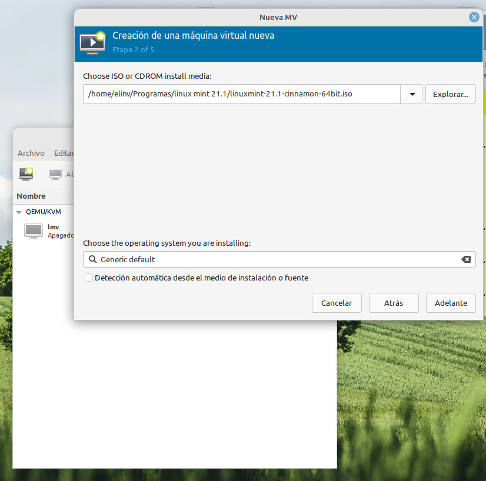
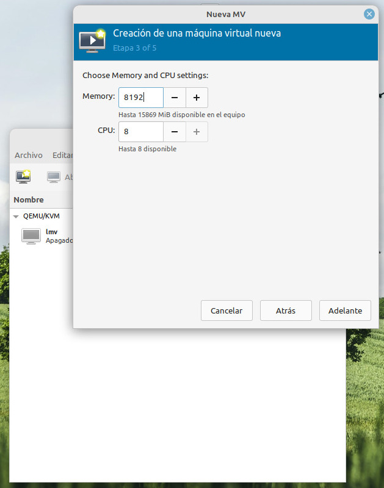
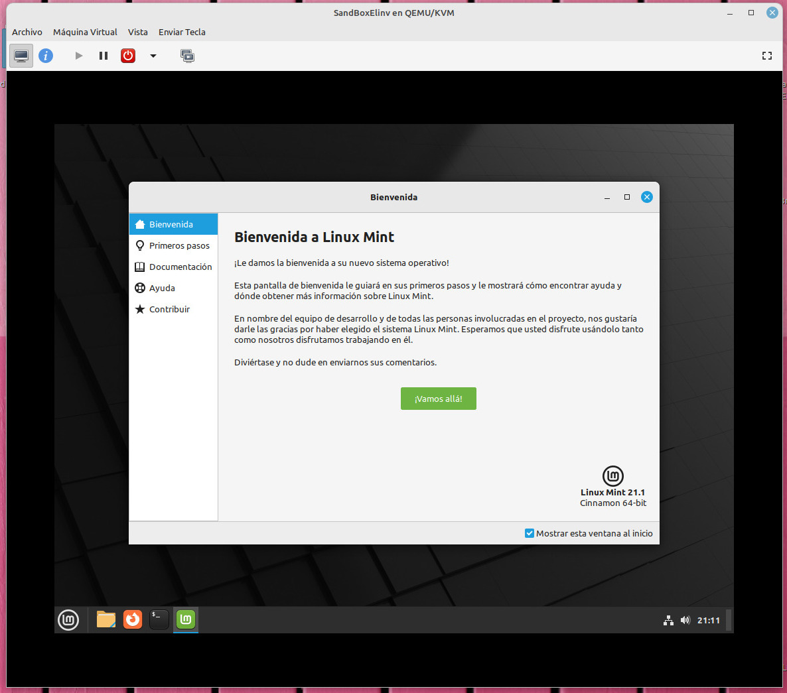
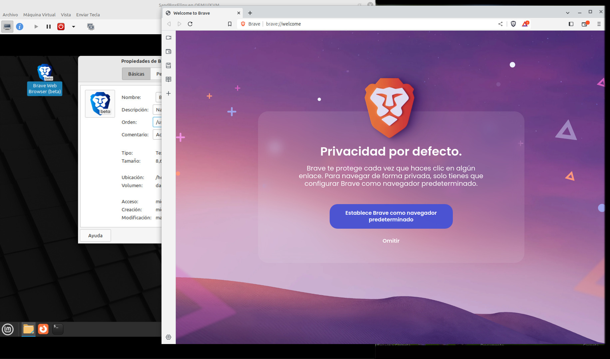

<h1 align="center">Sandbox-Elinv</h1>

# Poder navegar en el equipo anfitrión a pantalla completa, con absoluta desconocimiento del navegador del sistema anfitrion.

  

<h3 align="center">Sandbox absoluto Elinv</h3>

---

 Desarrollado en:

    Sistema Operativo:      Linux Mint 20.3 Cinnamon
    Versión de Cinnamon:    5.2.7
    Núcleo Linux:           5.4.0-139-generic
    Procesador:             Intel© Core™ i7-3770 CPU @ 3.40GHz × 4
    Memoria:                15.5 GiB
    Tarjeta gráfica:        NVIDIA Corporation GP107 [GeForce GTX 1050 Ti]

 Requisitos instalados:

</a>

    En la Bios, en opciones avanzadas, 
    tener habilitada la opción de virtualización.

    ----------------------------

    Virtual Machine Manager
    Versión:            2.2.1
    Potenciado por:     Libvirt

    Openssh-client:
    Versión:            1:8.2p1-4ubuntuO.5  Cliente SSH "Secure Shell"

    ----------------------------
    Openssh-server:
    Versión:            1:8.2p1-4ubuntuO.5  
                        Server module for SFTP accesos 
                        from remote machines.
                        
    Debe estar instalado en el equipo anfitrion 
    y en la maquina virtual que crearemos.
    ----------------------------

 Requisitos para instalar:

    Imagen:         linuxmint-21.1-cinnamon-64bit.iso   2,7 GB

## 📝 Manos a la obra

- Creamos una nueva maquina virtual.
- </a>

- Elegimos el volumen de almacenamiento 0
- </a>

- Elegimos el volumen de almacenamiento 1
- </a>

- Elegimos el volumen de almacenamiento 2
- </a>

- Asignamos memoria: en nuestro caso 1024 x 8
- </a>

- Imagen de disco de 20GB
- </a>

- Asignamos un nombre
- </a>

- Se ejecuta Linux Mint Live
- </a>

- Inmediatamente veremos la pantalla de inicio de Linux Mint
- </a>

- Click en el icono del escritorio ""Install Linux Mint""
- Inicia la instalación en la unidad virtual creada.
- elegimos el idioma
- </a>

- Seleccionamos disposición del teclado.
- </a>

- En nuestro caso instalamos los codec multimedia, por los usos que les damos.
- </a>

- Tipo de instalación que haremos 0.
- </a>

- Tipo de instalación que haremos 1.
- </a>

- Donde se encuentra
- </a>

- Usuario y clave de la instalación, tipo de inicio de la sesión 0
- </a>

- Usuario y clave de la instalación, tipo de inicio de la sesión 1
- </a>

- Instalando...
- </a>

- Descargando paquetes de idiomas durante la instalación
- </a>

- Terminada la instalación. Reiniciamos la maquina virtual creada.
- </a>

- Presionamos ENTER para remover el medio de instalación.
- </a>

- Reiniciada la maquina virtual creada, se verá así...
- </a>

- Vamos al gestor de Software.
- </a>

- Instalamos Openssh-server.
- </a>

- Instalamos Openssh-server: decimos que si...
- </a>

- Instalamos Openssh-server: autorizamos con nuestra credencial creada durante la instalación.
- </a>

- Openssh-server instalado.
- </a>

- En la consola de nuestra unidad virtual, ejecutamos : ifconfig.
- Vemos la conexión inet de la unidad virtual: 192.168.122.142
- </a>

## Fuera de la unidad virtual en el equipo anfitrion
    abrimos otra consola
    tecleamos: scp Install_Brave.sh elinv@192.168.122.142:elinv
    Se copiará a la unidad virtual el archivo "Install_Brave.sh" con el nombre elinv 
    Luego lo renombran a elinv.sh o pueden hacerlo directamente así:
    scp Install_Brave.sh elinv@192.168.122.142:Install_Brave.sh

    Texto del archivo: Install_Brave.sh
    -----------------------------------
    sudo apt install curl
    sudo curl -fsSLo /usr/share/keyrings/brave-browser-beta-archive-keyring.gpg https://brave-browser-apt-beta.s3.brave.com/brave-browser-beta-archive-keyring.gpg
    echo "deb [signed-by=/usr/share/keyrings/brave-browser-beta-archive-keyring.gpg] https://brave-browser-apt-beta.s3.brave.com/ stable main"|sudo tee /etc/apt/sources.list.d/brave-browser-beta.list
    sudo apt update
    sudo apt install brave-browser-beta
    -----------------------------------

    Como dice: 
    Instala el navegador Brave en nuestra unidad virtual.
- </a>

- Nos pedirá la clave de inicio de sesión, creada durante la instalación.
- </a>

- Si todo anda bien, se copiará el archivo desde el anfitrion al virtual
- Al reves trae desde el equipo virtual al anfitrion, es decir:
- scp elinv@192.168.122.142:Install_Brave.sh Install_Brave.sh
- </a>

- En la unidad virtual abrimos el explorer y vemos los archivos.
- </a>

- En la consola de la unidad virtual, ejecutamos el script sh.
- </a>

- Nos pide nuevamente el password de administrador.
- </a>

- Recuerde asignar permisos de ejecución al script.
- </a>

- Se comienza a instalar el navegador Brave
- </a>

- Terminada la instalación del navegador Brave.
- </a>

- En inicio, buscamos Brave y creamos un acceso directo al escritorio.
- </a>

- En el acceso directo del escritorio, en propiedades buscamos la dirección del ejecutable brave
- </a>

- Copiamos la directiva de ejecución.
- </a>

- Observen las dos consolas, 
- y las credenciales de identificación de cada una.
- Y en la consola del equipo anfitrion generamos la conexión ssh
- ssh -X elinv@192.168.122.142
- nos pide la clave generada durante la instalación 
- y en nuestra consola del equipo anfitrion, ya estamos dentro 
- de la unidad virtual.
- </a>

- Copiamos la directiva de ejecución de Brave de la unidad virtual 
- y tal cual está la escribimos 
- en la consola del equipo anfitrion.
- </a>

## Y tenemos abierto en el equipo anfitrion 
    el navegador Brave a pantalla completa, 
    pudiendo moverlo por todos los monitores.

    Y lo extraordinario de esto es 
    que todos los recursos que usa el navegador Brave, 
    o cualquier otro programa 
    que usen así de la unidad virtual, 
    solo reconocerá el sistema de la unidad virtual.

    Desconoce completamente 
    el sistema operativo del equipo anfitrion, 
    y sin embargo se ejecuta en él.
    de hecho todo lo que descarguen, 
    será a la unidad virtual, 
    y luego deberán 
    trasladarlo con la directiva scp
    al equipo anfitrion.

- </a>

- Al intentar guardar o descargar algo de este navegador, 
- la ventana de descarga se abre dentro de nuestro sandbox.
- </a>

- Así podrían llamar a Firefox, a Gedit, a Xed, 
- a cualquier programa instalado 
- o por instalar en nuestra caja segura..
- </a>

- Seguro, segurísimo, mas si graban una instantánea del momento exacto que les interesa
- y vuelven a ella luego de navegar en cualquier cantidad de sitios.
- Su sistema sandbox personal estará siempre limpio y seguro.
- </a>

## 🧐 Elinv 

## 🏁 Fácil, seguro y limpio. 

## ⛏️ Pruebenlo...

- Cualquier duda que tengan la dirigen a elinv@duck.com.

-  🛠️ Errores, sugerencias, ideas, envialas a nuestro mail: <elinv@duck.com>

- Ver info de Elinv en Google Search:  
<a href="https://www.google.com.ar/search?q=elinv">
   Enlace a la info de Elinv  -> en Google Search
</a>

- 👍 Saludos!

- Atte.

# Elinv.